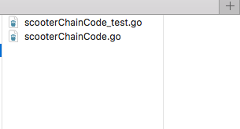
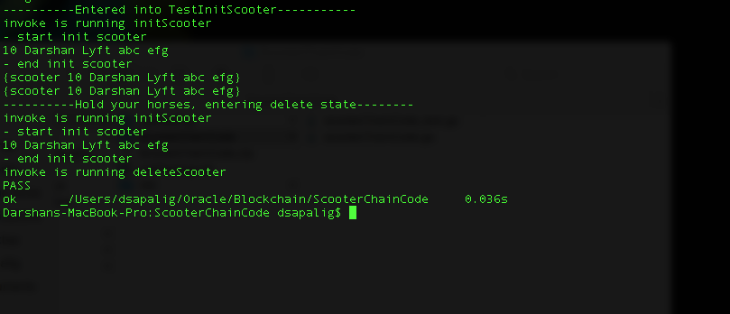

  
Updated: November 14, 2018

## Introduction

This is the first of several labs that are part of the **Oracle Blockchain Cloud workshop.** This will walk you through the process of   creating and **running offline tests** for your chaincode application.

This lab assumes that you have the chaincode set up and ready with atleast one function (initSomething should do), that you can use for testing.

**_To log issues_**, click here to go to the [github oracle](https://github.com/oracle/learning-library/issues/new) repository issue submission form.

## Objectives
- Setup the environment
- Create test case file

## Required Artifacts
- The following lab requires an chaincode file that uses shim from hyperledger fabric - mychaincode.go


# Lab 100

## OBCS: Create test cases for chaincode

### **STEP 1**: Setup environment

To begin with the testing you will need the hyperledger/fabric from git in your $GOPATH:/src/github.com/hyperledger/fabric. 

As of this lab (Nov 8, 18), the version I have worked with is 1.3 release of chaincode shim. If there is a newer version, you will have to verify if it works with Oracle Blockchain Cloud Service.


1.	Create a new file with _test.go at the end of the original file’s name you wish to test. Naming convention – fileToBeTested_test.go




2.	Your initial file should have the following commands. Package name same as the package in your original go file.

```
package main
import (
	"testing"
	"encoding/json"
	"reflect"
	"fmt"
	"github.com/hyperledger/fabric/core/chaincode/shim" 
)

```

3.	Each test function that you write, which you wish should be executed during the test run should have prefix “Test” to its name.
The test pointer is what we will use for marking test failures, etc. which you will see shortly

```
func TestInitScooters(t *testing.T) {}

```

### **STEP 2**: Test cases for each method in your chaincode.go file

Add the following to the above function


```
    fmt.Println("----------Entered into TestInitScooter-----------")

	var scooterId = "10"

	stub := shim.NewMockStub("mockChaincodeStub", new(SimpleChaincode))
	if stub == nil {
		t.Fatalf("MockStub creation failed")
	}

``` 

In order to test chaincode behavior without having to collect to the blockchain ledger, we can use a mocked interface, which mocks the state of the ledger and provides stub services using a map. In order to initialize this functionality we call the NewMockStub method, passing it an instance of our chaincode object.


Add your arguments matching your testing functions arguments requirements from chaincode.go. The first parameter in args is the name of the function that you wish to mock call.

The stub.MockInvoke method takes in 2 arguments - uuid, args. You can take any string as uuid for this scenario and put arguments variable.
This method will make a mock call to the initScooter function and save the data accordingly.

```
	args := [][]byte{
		[]byte("initScooter"),
		[]byte(scooterId),
		[]byte("name"),
		[]byte("Lyft"),
		[]byte("abc"),
		[]byte("efg")}

	invokeResult := stub.MockInvoke("12345", args)
	if invokeResult.Status != shim.OK {
		fmt.Println("--------------Error----------")
		fmt.Println(invokeResult)
        t.Fatalf("Expected unauthorized user error to be returned")
	}

```

**NOTE:** invokeResult is a peer.Response Object, which has the following three fields, use according to your case:

```
	type Response struct {
		// A status code that should follow the HTTP status codes. 
		Status int32
		
		// A message associated with the response code.
		Message string
		
		// A payload that can be used to include metadata with this response.
		Payload []byte
	}

```


Now, in order to check if the data was entered correctly you need to make a getState call with the same scooter Id you used above and in order to verify, create an expected result variable that you want to match with as below (newScooter).


```
	getResultAsBytes, err := stub.GetState(scooterId)
	if err != nil {
        t.Errorf("Failed to get state for " + scooterId)
    } else if getResultAsBytes == nil {
        t.Errorf("Vehicle part does not exist: " + scooterId)
    }

    expectedOutput := scooter{"scooter", "10", "Darshan", "Lyft", "abc", "efg"}

```

Finally unmarshall your result to get json value.
You can either create a new function in order to verify each field in your expectedOutput and the output you got, or you can use 'reflect' package to verify if they are equal as below.

```
	//convert getResultAsBytes to []string
	resultJSON := scooter{}
	error := json.Unmarshal(getResultAsBytes, &resultJSON)
	if error != nil {
		t.Errorf("Error unmarshalling getPartsByAssembler JSON result") 
	
	}
	fmt.Println(resultJSON)
	fmt.Println(expectedOutput)

	isEqual := reflect.DeepEqual(resultJSON, expectedOutput)
	if !isEqual {
		t.Fatalf("Unexpected response received")
	}
```


### **STEP 3**: Verify your console for passed/failed test cases

Run the following in your terminal where your test file is located:

```
	go test
```

You should end up with something like this in your terminal

